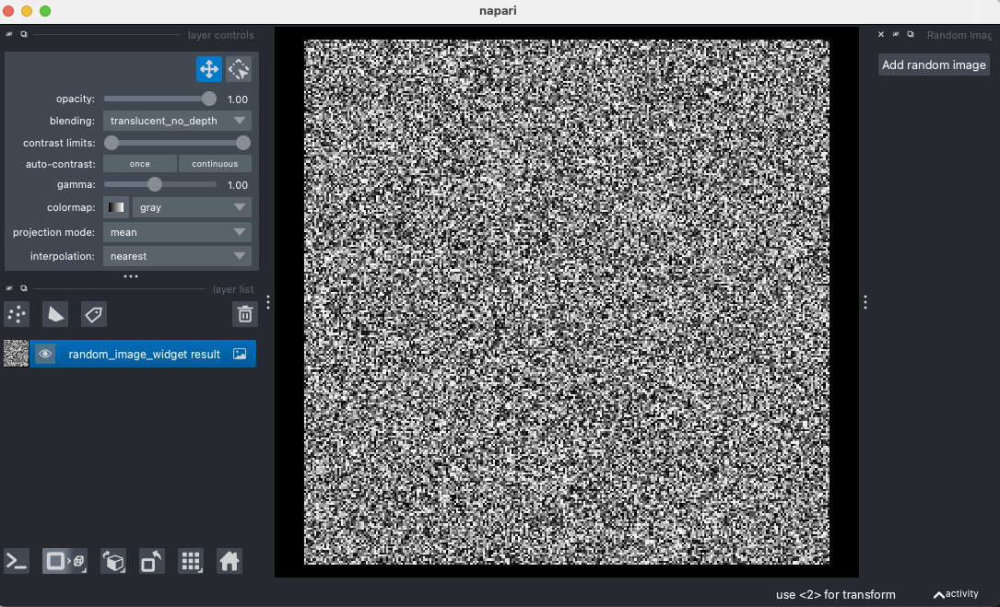

## Environment Setup for napari and plugin testing

### 1. Python and Conda setup
- Use **Python 3.11** (Napari ≥0.6 requires Python ≥3.10).
- Install **Miniforge** or **Miniconda** if not already present.
- Install **VS Code** (you can run napari from its terminal window)

### 2. Create a napari environment 

```bash
conda create -n napari-py311 python=3.11
conda activate napari-py311
```
### 3. Install required packages

```bash
pip install "napari[all]==0.6.4"
pip install numpy scipy skikit-image matplotlib
pip install magicgui npe2 qtpy
pip install PyQt6
```
### 4. Check versions after installation

```bash
pip show napari magicgui npe2 qtpy"
```
Expected outcomes:
```
Name: napari
Version: 0.6.4
Name: magicgui
Version: 0.10.1
Name: npe2
Version: 0.7.9
Name: QtPy
Version: 2.4.3
```
```bash
napari --info"
```
```
napari: 0.6.4
 Plugins:
  - napari
  - napari-console
  - napari-svg
```
### 5. Clone and install the napari-offlinecorrelation-test plugin

```bash
git clone https://github.com/JaeEYang/CorrelationMatlab.git
```
Load the napari-offlinecorrelation-test folder in VS Code to initiate a proper tree structure

### 6. Install the plugin 

```bash
pip install -e .
```
### 7. Verify installation of the plugin

```bash
npe2 list
```
Expected outcomes:
```
 offlinecorr    │ 0.0.0   │ ✅   │ commands (1), widgets (1) 
```
### 8. Launch napari and verify plugin
- Make sure you are in the **napari-py311** environment
```bash
napari
```
The napari window will pop up.  Under Plugins, the **Offline Correlation Test** should show up

### 9. Run Plugins --> Offline Correlation Test/Add random image --> Add random image
If the plugin runs properly, you will see a window below


### 9. Run Plugins --> Offline Correlation Test/Load FLM image with registration points
If the plugin runs properly, you will see a window below

Use the [FLM image](../data/X7Y6_FLM_RGB_2.tif) and registration points [FLM registration points](../data/Item2_X7Y6_FLM_RegSpread9.csv)

### 10. Modify the _widget.py and napari.yaml files and restart napari

- If you want to add more functions to the plugin, edit the _widget.py and napari.yaml files based on the [instructions](https://napari.org/stable/plugins/building_a_plugin/index.html#how-to-build-a-plugin).
- In VS Code, in the workspace folder **NAPARI-OFFLINECORRELATION-TEST**
  ```bash
  rm -rf src/offlinecorr.egg-info
  pip uninstall -y offlinecorr
  pip install -e .
  npe2 list
  napari
  ```
- If the plugin shows under the **Plugins** menu tab, the plugins have been recognized. 
